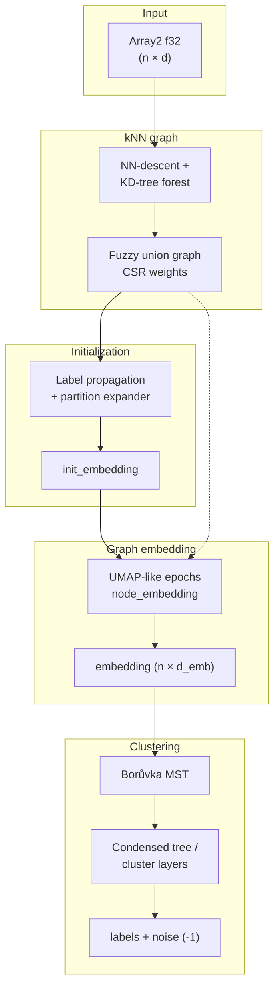

# Architecture

This document describes how **evoc-rs** implements the EVōC pipeline in Rust and how
modules map to the [Python reference](https://github.com/TutteInstitute/evoc).

## Pipeline overview

EVōC clusters **rows of a matrix** \(X \in \mathbb{R}^{n \times d}\) (one embedding
vector per row). Rows should be **L2-normalized** for cosine kNN on `f32` data.



### Stages (conceptual)

| Stage | Output | Primary modules |
|-------|--------|-----------------|
| kNN | `nn_inds`, `nn_dists` | `knn`, `nndescent`, `kdtree`, `heap` |
| Fuzzy graph | weighted CSR `graph` | `graph_construction`, `csr_matmul` |
| Init | `init_embedding` | `label_prop`, `faer` (SVD/PCA pieces) |
| Embedding | `embedding` | `embed`, `rng`, `numpy_rng` |
| Clustering | `labels`, `cluster_layers_` | `boruvka`, `cluster_trees`, `cluster_util`, `clustering` |

The public entry point is [`Evoc::fit_predict`](src/clustering.rs), which orchestrates
[`evoc_clusters`](src/clustering.rs) and stores results on the struct (`labels_`,
`embedding_`, `cluster_layers_`, etc.).

## Module map (Rust → Python)

| Rust module | Python / upstream | Responsibility |
|-------------|-------------------|----------------|
| `knn` | `knn_graph.py`, `*_nndescent.py` | kNN indices & distances (`f32` / `i8` / packed `u8`) |
| `nndescent` | `float_nndescent.py`, `common_nndescent.py` | NN-descent heap updates |
| `kdtree` | `numba_kdtree.py` | Forest for NN-descent initialization |
| `graph_construction` | `graph_construction.py` | Smooth kNN dist, membership strengths, symmetrize |
| `label_prop` | `label_propagation.py` | Partition reduction, expander, PCA init path |
| `embed` | `node_embedding.py` | Epoch schedule, SGD-style graph embedding |
| `boruvka` | `boruvka.py` | Parallel MST for HDBSCAN core |
| `cluster_trees` | `cluster_trees.py` | Condensed tree, leaves, membership strengths |
| `cluster_util` | `clustering_utilities.py` | Layer selection, peak finding, duplicates |
| `clustering` | `clustering.py` | `EVoC` API, `fit_predict`, layer building |
| `numpy_rng` | NumPy `RandomState` | Bit-compatible RNG for parity |
| `rng` | Numba RNG kernels | `tau_rand`, state updates |
| `csr_matmul` | SciPy CSR matmul | Label-prop sparse algebra |
| `np_argsort` | NumPy argsort | Tie-breaking compatible sorts |

### Dataset helpers (Rust-only)

| Module | Data | Download |
|--------|------|----------|
| `idx_digits` | MNIST, Fashion-MNIST IDX | HTTP gzip → cache |
| `mnist_data` / `fashion_mnist_data` | 28×28 images | `EVOC_MNIST_DIR`, `EVOC_FASHION_MNIST_DIR` |
| `news20_data` | 20 Newsgroups train | tar.gz (qwone.com mirror) |
| `bbc_news_data` | BBC News (5 topics) | zip (UCD) |
| `text_bow` | Hashed BoW features | shared by text loaders |

## Compute backends

```text
EVOC_BACKEND=strict     → reference CPU path (default; parity)
EVOC_BACKEND=cpu|cuda|mlx|metal|rocm|wgpu|gpu  → matching RLX backend (requires `rlx-*` feature)
```

Implemented in `rlx_backend/` (`strict`, `cpu`, `metal`). With `strict_precision`,
accelerated paths must match strict results or fall back.

Cargo features: `rlx` plus `rlx-cpu`, `rlx-cuda`, `rlx-mlx`, `rlx-rocm`, `rlx-wgpu` (each enables the matching RLX runtime backend; currently delegates to strict).

## Parallelism

- **Rayon** thread pools for row-wise and graph parallel work (`RAYON_NUM_THREADS`).
- Borůvka MST thread count follows Python parity (`1` when `reproducible_flag`, else
  `rayon::current_num_threads()`).

## Reproducibility and parity

Golden fixtures under `tests/fixtures/` in the git repo (`small_200`, `medium_800`,
`large_2000`; not shipped on crates.io):

| Checkpoint | Purpose |
|------------|---------|
| `nn_inds.npy`, `nn_dists.npy` | Bit-exact kNN |
| `intermediates/graph_coo.npz` | Fuzzy graph weights |
| `intermediates/init_embedding.npy` | Label-prop init |
| `intermediates/rng_*` | NumPy RNG streams |
| `labels.npy` (generated) | End-to-end clustering |

Set `Evoc.parity_graph_coo` to load Python graph/init checkpoints — required for
**0 label mismatches** on goldens. Without them, init/embedding numeric drift can
change cluster labels on large ad-hoc data.

**Embedding distance:** pure Rust `rdist` in `embed.rs` for stable labels.

## f32 kNN distance (`rlx-cpu`)

Float NN-descent calls [`fast_cosine`](src/fast_cosine.rs): **RLX** (`rlx-cpu` NEON dot) on the
default fast path; deterministic / parity runs use a small C `-ffast-math` helper to match
Python Numba goldens (`native/fast_cosine.c`).

## Binaries and examples

| Kind | Purpose |
|------|---------|
| `bench`, `bench_huge` | Timing / scale |
| `mnist_fetch`, `fashion_mnist_fetch` | Dataset → `.npy` |
| `mnist_labels` | `fit_predict` + export; `--mnist` / `--fashion-mnist` |
| `emb_epoch_diff` | Per-epoch embedding vs Python dumps |
| `examples/*` | In-memory, user `.npy`, dataset clustering demos |

## Data layout conventions

- **Input:** `Array2<f32>` shape `(n_samples, n_features)`, row-major, L2-normalized rows.
- **Graph:** CSR `sprs::CsMat<f32>`, symmetric fuzzy union weights.
- **Labels:** `i64`, `-1` = noise (HDBSCAN-style).
- **Layers:** `cluster_layers_[0]` finest granularity; later entries coarser.

## Further reading

- [README.md](README.md) — install, quick start, examples  
- [examples/README.md](examples/README.md) — runnable demos and figures  
- [CONTRIBUTING.md](CONTRIBUTING.md) — build, test, parity workflow  
- [CITATION.md](CITATION.md) — how to cite PLSCAN and EVōC  
