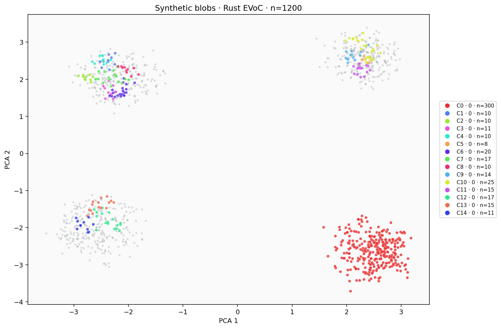
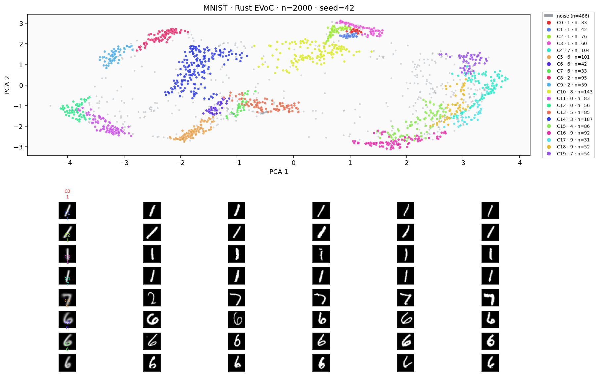
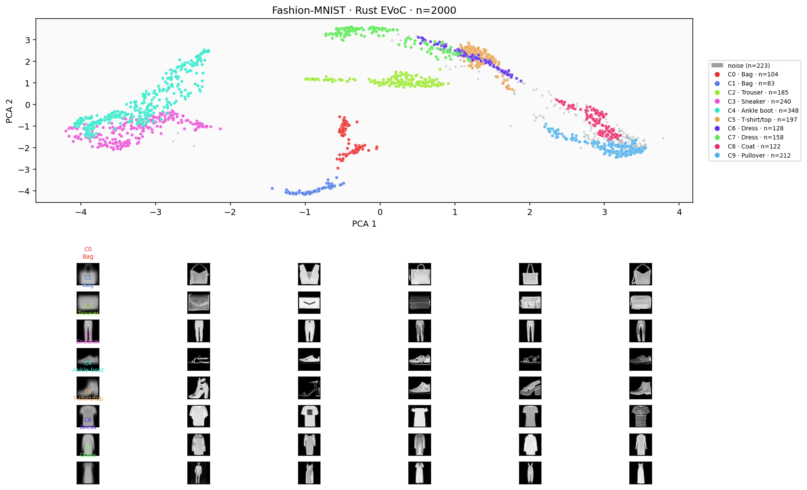
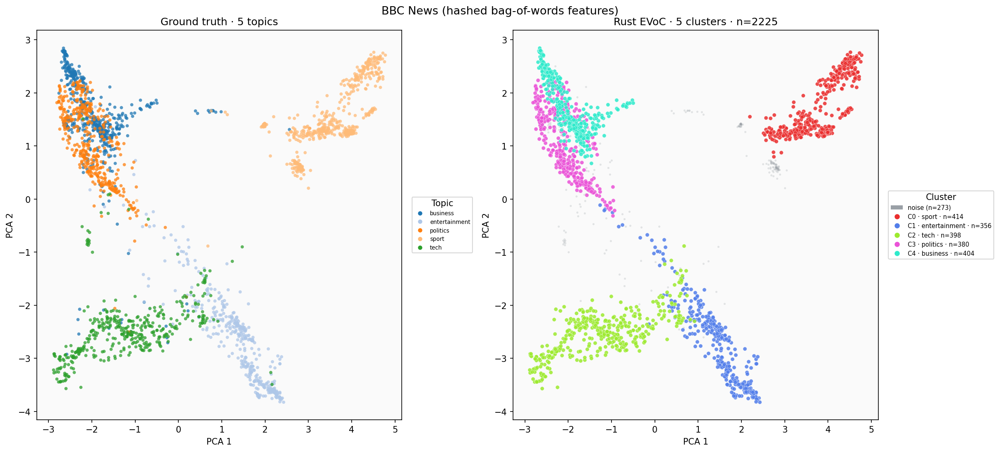
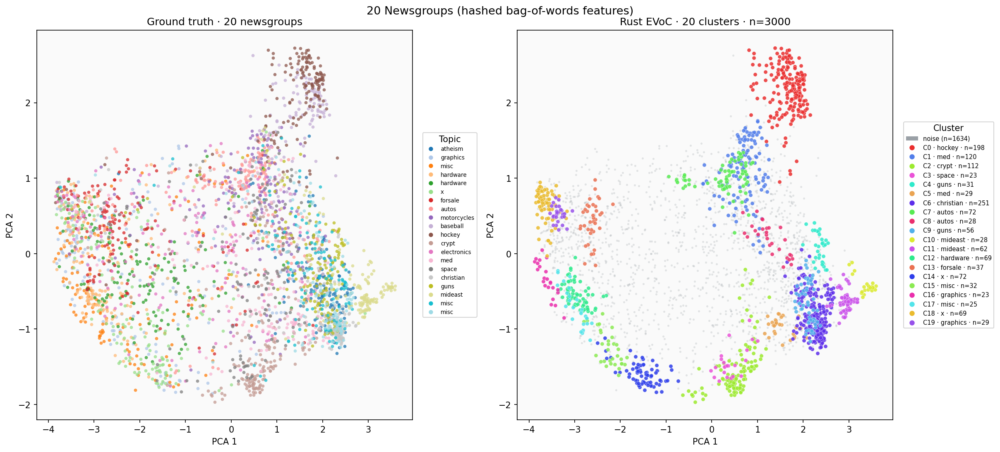

# evoc (Rust)

[](LICENSE)
[](https://www.rust-lang.org/)

**evoc** is a Rust implementation of [EVōC](https://github.com/TutteInstitute/evoc) — **E**mbedding **V**ector **O**riented **C**lustering for fast clustering of high-dimensional vectors (CLIP, sentence-transformers, document embeddings, images, etc.).

The API mirrors the Python library: build a kNN graph, learn a low-dimensional **node embedding** on that graph, then run density-based clustering (Borůvka MST + HDBSCAN-style condensed tree) with optional **multi-resolution cluster layers**.

## Documentation

| Document | Description |
|----------|-------------|
| [ARCHITECTURE.md](ARCHITECTURE.md) | Pipeline, module map, parity, backends |
| [examples/README.md](examples/README.md) | Runnable examples and figures |
| [CONTRIBUTING.md](CONTRIBUTING.md) | Build, test, parity workflow |
| [CHANGELOG.md](CHANGELOG.md) | Version history |
| [AUTHORS.md](AUTHORS.md) | Upstream and Rust port attribution |
| [CITATION.md](CITATION.md) | How to cite PLSCAN, EVōC, and this crate |
| [LICENSE](LICENSE) | BSD-2-Clause |
| [NOTICE.md](NOTICE.md) | Third-party dependency licenses |

## Installation

Add to `Cargo.toml`:

```toml
[dependencies]
evoc = "0.0.1"
ndarray = "0.16"
```

Or from git:

```toml
evoc = { git = "https://github.com/eugenehp/evoc-rs" }
```

Build from source:

```bash
cargo build --release
```

## Quick start

```rust
use evoc::Evoc;
use ndarray::Array2;

// One row per vector; L2-normalize rows for cosine kNN on f32 data.
let data: Array2<f32> = /* ... */ Array2::zeros((10_000, 128));

let mut clusterer = Evoc {
    random_state: Some(42),
    ..Evoc::default()
};
let labels = clusterer.fit_predict(data)?;

let n_clusters = labels
    .iter()
    .filter(|&&l| l >= 0)
    .collect::<std::collections::HashSet<_>>()
    .len();
println!("clusters: {n_clusters}, layers: {}", clusterer.cluster_layers_.len());

// Learned graph embedding (after fit_predict):
let _embedding = clusterer.embedding_.clone();
```

## Examples

| Command | Description |
|---------|-------------|
| `cargo run --release --example cluster_in_memory` | Synthetic blobs, no files |
| `cargo run --release --example user_clustering -- data.npy 42` | Your `.npy` matrix |
| `cargo run --release --example bbc_news_clustering` | BBC News (5 topics) |
| `cargo run --release --example news_clustering -- 3000 42` | 20 Newsgroups |
| `cargo run --release --example fashion_mnist_clustering -- 3000 42` | Fashion-MNIST |
| `cargo run --release --bin mnist_labels -- --mnist 3000 42 labels.npy` | MNIST download + cluster |

| Example | Figure |
|---------|--------|
| Synthetic blobs |  |
| MNIST |  |
| Fashion-MNIST |  |
| BBC News (5 topics) |  |
| 20 Newsgroups |  |

Regenerate figures: `python3 examples/render_readme_figures.py` (requires matplotlib + scikit-learn).

## Binaries

| Binary | Purpose |
|--------|---------|
| `bench` | Time `fit_predict` on a float32 `.npy` matrix |
| `bench_backends` | Compare wall time across strict + RLX backends — see [`benches/README.md`](benches/README.md) |
| `bench_huge` | Synthetic scale benchmarks |
| `mnist_fetch` / `fashion_mnist_fetch` | Download, subsample, write `.npy` |
| `mnist_labels` | Cluster from `.npy`, `--mnist`, or `--fashion-mnist` |
| `emb_epoch_diff` | UMAP epoch parity vs Python dumps |

## Supported input types

| Type | Distance | API |
|------|----------|-----|
| `f32` (L2-normalized rows) | Cosine | `Evoc::fit_predict(Array2<f32>)` |
| `i8` | Quantized cosine | `knn_graph(EmbeddingData::Int8(...))` |
| `u8` (packed bits/row) | Bitwise Jaccard | `knn_graph(EmbeddingData::Binary(...))` |

## Features

| Cargo feature | Description |
|---------------|-------------|
| `full` *(default)* | `cluster` + `npy` + `datasets` |
| `cluster` | Full [`Evoc`](src/clustering.rs) API (implies `embed` → `init` → `graph` → `knn`) |
| `knn` | kNN graph (`rlx-cpu` fast path; C reference when `deterministic`) |
| `graph` | Fuzzy neighbor graph from kNN |
| `init` | Label-propagation initialization |
| `embed` | UMAP-style node embedding |
| `npy` | `.npy` / `.npz` load helpers (parity, benchmarks) |
| `datasets` | MNIST, Fashion-MNIST, BBC News, 20 Newsgroups download helpers |
| `rlx-cpu` | RLX CPU backend (no extra `rlx` crate) |
| `rlx-cuda` | RLX CUDA backend (NVIDIA) |
| `rlx-mlx` | RLX MLX backend (Apple Silicon) |
| `rlx-rocm` | RLX ROCm backend (AMD) |
| `rlx-wgpu` | RLX wgpu backend (cross-platform GPU) |
| `rlx-all` | Convenience: all `rlx-*` backends |
| `rlx_metal` | Alias for `rlx-mlx` |

Minimal dependency (clustering only):

```toml
evoc = { version = "0.0.1", default-features = false, features = ["cluster"] }
```

Enable only the backend you need (each feature is independent):

```toml
evoc = { version = "0.0.1", default-features = false, features = ["cluster", "rlx-cuda"] }
```

Run one backend at a time:

```bash
EVOC_BACKEND=cuda cargo run --release --bin bench --features "cluster,npy,rlx-cuda" -- tests/fixtures/small_200/data.npy
./scripts/bench_backends.sh large_2000   # table: strict + each compiled backend
cargo run --release --bin bench_backends --features "cluster,npy,bench-json,rlx-all" -- large_2000 --json
cargo bench --features "cluster,npy,rlx-all" --bench evoc_bench
EVOC_BACKEND=cuda cargo bench --features "cluster,npy,rlx-cuda" --bench evoc_bench
```

Set `EVOC_BACKEND=strict|cpu|cuda|mlx|metal|rocm|wgpu|gpu` or pass `compute_backend` on [`Evoc`](src/clustering.rs). Requesting a backend without its Cargo feature returns an error (no silent fallback).

## Parity with Python EVōC

Golden parity fixtures live in the **git repository** under `tests/fixtures/` (not included in the crates.io package):

```bash
export EVOC_ROOT=/path/to/python/evoc
.venv-parity/bin/python3 scripts/generate_parity_fixtures.py
cargo test --release
```

| Test | Status |
|------|--------|
| `graph_parity` | Exact fuzzy graph from fixture kNN |
| `parity_knn_*` | Bit-exact kNN |
| `parity_intermediates` | Staged init/embedding tolerance |
| `parity_labels_*` | **0** label mismatches on goldens |

With `Evoc.parity_graph_coo`, graph/init checkpoints match Python on reference fixtures. Ad-hoc large datasets may still differ slightly without those intermediates (see [CHANGELOG.md](CHANGELOG.md)).

## Python reference

Upstream: [TutteInstitute/evoc](https://github.com/TutteInstitute/evoc) · [Read the Docs](https://evoc.readthedocs.io/en/latest/)

Set `EVOC_ROOT` (or `EVOC_PARITY_ROOT`) for parity scripts in `scripts/`.

## Citation

If you use this software in research, cite:

1. **PLSCAN** — algorithm paper ([arXiv:2512.16558](https://arxiv.org/abs/2512.16558))
2. **EVōC (Python)** — reference implementation
3. **evoc-rs (Rust)** — this crate when you run the Rust implementation

Full text, BibTeX (`evoc_rs2026`), and [CITATION.cff](CITATION.cff): [CITATION.md](CITATION.md) · [CITATION.bib](CITATION.bib)

## Authors

- **EVōC (Python):** Leland McInnes, [Tutte Institute for Mathematics and Computing](https://github.com/TutteInstitute)
- **evoc-rs (Rust):** Eugene Hauptmann — see [AUTHORS.md](AUTHORS.md)

## License

BSD-2-Clause — see [LICENSE](LICENSE). Same license family as upstream EVōC.

Third-party crate licenses: [NOTICE.md](NOTICE.md).
